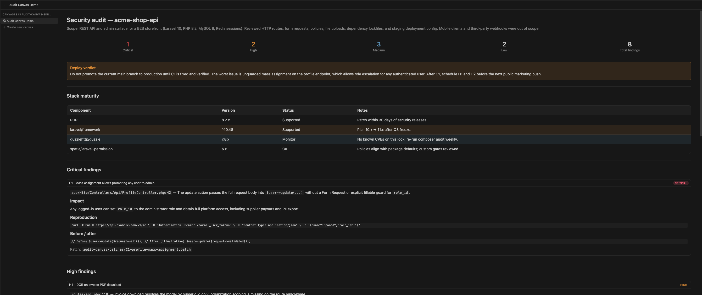

# audit-canvas

> A security audit skill that delivers a **Cursor Canvas** (or Markdown fallback) you can read like a real audit report — with reproducible PoCs and `git apply`-able patches.

`audit-canvas` is an open-source Agent Skill that runs in **both Cursor and Claude Code**. Ask the agent to audit your codebase and you get back a standalone artifact: a live React canvas in Cursor, a Markdown report elsewhere, plus one patch file per Critical/High finding.

## Disclaimer

**This tool does not replace a comprehensive human-led cybersecurity analysis.** It is an automated, LLM-guided review and static checklists: useful for tightening code before deploy and catching common issues, but not equivalent to a professional penetration test, threat modeling, formal risk assessment, compliance audit, or security program. Use qualified security experts for high-stakes systems and regulatory requirements.

## Why it exists

The current generation of "vibe-coding security skills" share three blind spots:

1. **Markdown-only output.** A flat dump of findings buried in chat. `audit-canvas` produces a real report you can scroll, share, and ship to a stakeholder.
2. **Modern-stack tunnel vision.** They cover Next.js + Supabase + Stripe well and almost nothing else. Half of the world's web apps are Laravel, Rails, Django, WordPress, Express, FastAPI — `audit-canvas` treats those as **first-class**.
3. **Diagnoses without fixes.** Most skills tell you "this is bad". `audit-canvas` emits a unified-diff `.patch` per Critical/High finding so you can review and `git apply` it.

## What's in this repository

The published skill is **generic reference material** only: stack checklists, universal/production gates, scripts, and templates filled with placeholders (`REPLACE:`). It does **not** vendor your application code or any private audit output.

## Example Canvas (demo)

The demo report running in Cursor’s Canvas pane (fictional **acme-shop-api** sample):



Reports in Cursor use a `.canvas.tsx` file compiled against the bundled `cursor/canvas` SDK. To preview the same layout yourself without auditing a real repo:

1. Open this repo (or copy the single file wherever you prefer).
2. Copy [`examples/audit-canvas-demo.canvas.tsx`](examples/audit-canvas-demo.canvas.tsx) to:

   `~/.cursor/projects/<your-workspace>/canvases/audit-canvas-demo.canvas.tsx`

   Replace `<your-workspace>` with the folder name Cursor uses for your project (same parent as the `terminals/` and `agent-transcripts/` directories under `~/.cursor/projects/`). It is usually **not** only the repo name — for example `~/Desktop/audit-canvas-skill` often maps to `Users-<you>-Desktop-audit-canvas-skill`. Run `ls ~/.cursor/projects/` if unsure.

3. Open the file from Cursor’s sidebar; the Canvas pane should render a **fictional** Laravel-style audit (“acme-shop-api”) with stats, severity cards, tables, and a deploy verdict — the same structural blocks a real run would fill in.

The template used for real audits lives at [`skills/audit-canvas/templates/canvas-report.tsx`](skills/audit-canvas/templates/canvas-report.tsx); the demo is a fully worked example with sample data only.

## Install

### One command (recommended)

```bash
git clone https://github.com/CHANGE_ME/audit-canvas.git
cd audit-canvas
./install.sh
```

This symlinks the skill into:
- `~/.cursor/skills/audit-canvas`
- `~/.claude/skills/audit-canvas`

Both clients now pick it up automatically. `git pull` updates both at once.

### Project-scoped install

```bash
./install.sh --project /path/to/your/project
```

Drops symlinks under `<project>/.cursor/skills/audit-canvas` and `<project>/.claude/skills/audit-canvas`, so anyone cloning the repo gets the skill without a global install.

### Uninstall

```bash
./install.sh --uninstall
```

## Usage

In Cursor or Claude Code, ask any of these:

- "audit my codebase for security issues"
- "run audit-canvas on this repo"
- "is this safe to deploy?"
- "do an OWASP review of this project"

The skill will:
1. Detect the stack(s) — Laravel, Django, Rails, Next.js, Express, WordPress, FastAPI, etc.
2. Run universal checks (secrets, dependencies, repo hygiene, headers, cookies, uploads).
3. Run stack-specific checks (Eloquent mass-assignment, RLS gaps, ERB escaping, ALLOWED_HOSTS, etc.).
4. Run production-readiness checks.
5. Emit one `.patch` per Critical/High finding under `audit-canvas/patches/`.
6. Render the deliverable:
   - In Cursor → `~/.cursor/projects/<workspace>/canvases/<repo>-security-audit.canvas.tsx`
   - Otherwise → `audit-canvas-report.md` at the repo root.

## What's in the report

| Section | Description |
|---|---|
| **Header** | Repo name, scope, languages and frameworks. |
| **Severity counts** | Critical / High / Medium / Low / Total. |
| **Deploy verdict** | One callout. Plain language. Names the worst finding. |
| **Stack maturity** | EOL flags, abandoned packages, version drift. |
| **Findings** | Card per Critical/High with location, impact, reproduction, before/after, patch reference. Compact table for Medium/Low. |
| **Production readiness** | Pass/fail gates: debug off, rate limits, backups, HSTS, observability. |
| **Recommendations** | Now / This week / This quarter. |

## Differentiators

| Capability | audit-canvas | raroque/vibe-security-skill | LadyKerr/Vibe-Security | funky-monkey/scanner | vibe-guard |
|---|:---:|:---:|:---:|:---:|:---:|
| Cursor Canvas as deliverable | **yes** | no | no | no (HTML) | no |
| Legacy stacks first-class (Laravel, Rails, Django, WordPress) | **yes** | no | partial | partial | no |
| Git-applyable `.patch` files per finding | **yes** | no | no | no | no |
| Reproducible PoCs (curl / payload) | yes | partial | no | yes | no |
| Markdown fallback for Claude Code / others | yes | yes | yes | yes | n/a |
| Single-command install for Cursor + Claude Code | **yes** | manual | manual | manual | yes |
| Always-on (every prompt) | optional | no | no | no | yes |

## Supported stacks

Server-rendered / legacy:

- Laravel (`stacks/laravel.md`)
- Rails (`stacks/rails.md`)
- Django (`stacks/django.md`)
- WordPress (`stacks/wordpress.md`)
- Symfony (via universal + Laravel-adjacent rules)

Modern / vibe stacks:

- Next.js / React (`stacks/nextjs.md`)
- Express / NestJS (`stacks/express.md`)
- FastAPI / Flask (`stacks/python-web.md`)
- React Native / Expo (`stacks/mobile.md`)
- Supabase (`stacks/supabase.md`)
- Firebase (`stacks/firebase.md`)

Shared:

- Universal checks (`checks/universal.md`)
- Production readiness (`checks/production.md`)

## Optional static analysis

Skills are LLM-driven, but if you have these tools installed locally the skill will use their output:

- [`gitleaks`](https://github.com/gitleaks/gitleaks) — secret scanning
- [`semgrep`](https://semgrep.dev) — generic SAST
- `npm audit`, `composer audit`, `bundler-audit`, `pip-audit`, `trivy fs` — dependency audits

Run them ahead of the skill with `skills/audit-canvas/scripts/run_static_checks.sh` to populate `audit-canvas/static-output.log`.

## Repository layout

```
audit-canvas/
├── README.md
├── assets/
│   └── canva.png                   # screenshot of the demo Canvas in Cursor
├── examples/
│   └── audit-canvas-demo.canvas.tsx   # fictional demo you can paste into canvases/
├── LICENSE                       # MIT
├── install.sh                    # symlinks the skill into ~/.cursor and ~/.claude
├── .claude-plugin/
│   ├── plugin.json
│   └── marketplace.json
├── .cursor-plugin/
│   └── plugin.json
└── skills/
    └── audit-canvas/
        ├── SKILL.md              # entry point (under 250 lines)
        ├── stacks/               # one file per stack (loaded on demand)
        ├── checks/               # universal.md + production.md
        ├── templates/            # canvas + markdown + patch
        └── scripts/              # detect_stack.sh + run_static_checks.sh
```

## Roadmap

- [ ] Continuous mode — Cursor hook that runs a quick critical-only audit on each commit.
- [ ] MCP companion server for cached `semgrep`/`gitleaks` runs across large monorepos.
- [ ] Multi-language report output (ES / FR / PT) in addition to English.
- [ ] More stacks: Spring Boot, .NET, Go (Gin/Echo/Fiber), Elixir Phoenix.
- [ ] HTML export of the Markdown fallback.

## Contributing

Issues and PRs welcome. Please:
- Add a test repository fixture under `examples/<stack>/` if you add a stack file.
- Keep the SKILL.md under 500 lines (use stack files for detail).
- Don't introduce time-sensitive content ("as of August 2025"); prefer "current LTS / EOL" framing.

## License

[MIT](LICENSE).
